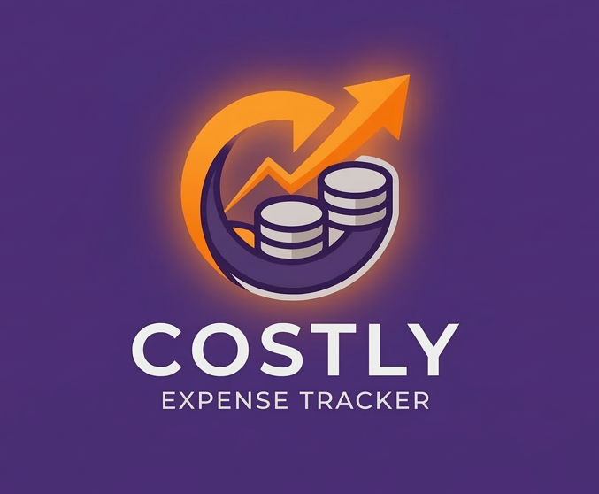

<div align="center">
  
  
  # 💰 Costly — Expense Tracker
  
  **Take control of your finances with a beautiful, modern expense tracker.**

  [](https://flutter.dev)
  [](https://dart.dev)
  [](https://firebase.google.com)
  [](LICENSE)
  [](CONTRIBUTING.md)

  <br/>
  
  *A sleek, cross-platform personal finance app built with Flutter & Firebase — designed to make tracking expenses effortless and insightful.*

</div>

---

## ✨ Features

<table>
  <tr>
    <td width="50%">
      <h3>📊 Smart Dashboard</h3>
      <ul>
        <li>Real-time balance overview with income & expense breakdown</li>
        <li>Beautiful gradient balance card</li>
        <li>Recent transactions at a glance</li>
        <li>Quick action buttons for adding income & expenses</li>
      </ul>
    </td>
    <td width="50%">
      <h3>📈 Analytics & Insights</h3>
      <ul>
        <li>Monthly spending trends with interactive bar charts</li>
        <li>Category breakdown with donut chart visualization</li>
        <li>Budget progress tracking</li>
        <li>Top spending categories ranked</li>
      </ul>
    </td>
  </tr>
  <tr>
    <td width="50%">
      <h3>📝 Transaction Management</h3>
      <ul>
        <li>Add expenses & income with categories</li>
        <li>Date-grouped transaction history</li>
        <li>Search & filter (All / Expenses / Income)</li>
        <li>Swipe-to-delete transactions</li>
      </ul>
    </td>
    <td width="50%">
      <h3>🔐 Secure Authentication</h3>
      <ul>
        <li>Firebase email/password authentication</li>
        <li>Google Sign-In integration</li>
        <li>Persistent sessions with auto-login</li>
        <li>Secure cloud data storage</li>
      </ul>
    </td>
  </tr>
</table>

---

## 🎨 Design Highlights

| Feature | Description |
|---------|-------------|
| 🌈 **Purple Theme** | Elegant purple gradient palette (`#5D3891` → `#7B52AB` → `#9B6FCF`) |
| 🧊 **Glassmorphic Nav Bar** | Floating navigation bar with backdrop blur and notch design |
| ✨ **Premium Cards** | White cards with subtle shadows and smooth rounded corners |
| 📱 **Modern UI** | Clean typography, micro-animations, and responsive layouts |
| 🌊 **Splash Screen** | Animated logo reveal with gradient background |

---

## 🛠️ Tech Stack

<div align="center">

| Layer | Technology |
|-------|-----------|
| **Framework** | Flutter 3.x (Dart) |
| **State Management** | Provider |
| **Backend** | Firebase (Auth + Cloud Firestore) |
| **Charts** | FL Chart |
| **Local Storage** | Shared Preferences |
| **Date Formatting** | intl |

</div>

---

## 📁 Project Structure

```
costly/
├── lib/
│   ├── main.dart                    # App entry point & route config
│   ├── firebase_options.dart        # Firebase configuration
│   ├── models/
│   │   ├── transaction_model.dart   # Transaction data model
│   │   └── user_model.dart          # User data model
│   ├── providers/
│   │   ├── auth_provider.dart       # Authentication state management
│   │   └── transaction_provider.dart # Transaction state & business logic
│   ├── services/
│   │   ├── auth_service.dart        # Firebase Auth service
│   │   ├── database_service.dart    # Firestore database service
│   │   └── transaction_service.dart # Transaction CRUD operations
│   ├── screens/
│   │   ├── splash_screen.dart       # Animated splash screen
│   │   ├── login_screen.dart        # Login with email & Google
│   │   ├── register_screen.dart     # User registration
│   │   ├── home_dashboard.dart      # Main dashboard
│   │   ├── transactions_history.dart # Transaction history & search
│   │   ├── analytics.dart           # Charts & spending insights
│   │   ├── profile.dart             # User profile & settings
│   │   ├── add_expense.dart         # Add expense form
│   │   └── add_income.dart          # Add income form
│   ├── widgets/
│   │   └── floating_nav_bar.dart    # Reusable glassmorphic nav bar
│   └── utils/
│       └── constants.dart           # Colors, helpers & category data
├── assets/
│   └── images/                      # App logos and images
├── android/                         # Android platform config
├── ios/                             # iOS platform config
├── web/                             # Web platform config
└── pubspec.yaml                     # Dependencies & assets
```

---

## 🚀 Getting Started

### Prerequisites

- [Flutter SDK](https://docs.flutter.dev/get-started/install) (3.x or later)
- [Firebase CLI](https://firebase.google.com/docs/cli) (for Firebase setup)
- A Firebase project with **Authentication** and **Cloud Firestore** enabled

### Installation

1. **Clone the repository**
   ```bash
   git clone https://github.com/yourusername/costly.git
   cd costly
   ```

2. **Install dependencies**
   ```bash
   flutter pub get
   ```

3. **Configure Firebase**
   
   Create a Firebase project and add your config:
   - Enable **Email/Password** and **Google Sign-In** in Firebase Auth
   - Create a **Cloud Firestore** database
   - Replace `lib/firebase_options.dart` with your own Firebase config
   
   > 💡 You can use the [FlutterFire CLI](https://firebase.flutter.dev/docs/cli/) to auto-generate this:
   > ```bash
   > dart pub global activate flutterfire_cli
   > flutterfire configure
   > ```

4. **Run the app**
   ```bash
   # For Chrome (Web)
   flutter run -d chrome
   
   # For Android
   flutter run -d android
   
   # For iOS
   flutter run -d ios
   ```

5. **Build for production**
   ```bash
   # Android APK
   flutter build apk
   
   # Web
   flutter build web
   
   # iOS
   flutter build ios
   ```

---

## 📱 Screens Overview

| Screen | Description |
|--------|-------------|
| 🌊 **Splash** | Animated logo reveal with purple gradient |
| 🔑 **Login** | Email & Google sign-in with modern UI |
| 📝 **Register** | New user registration form |
| 🏠 **Dashboard** | Balance card, quick actions, recent transactions |
| 📋 **History** | Date-grouped transactions with search & filters |
| 📊 **Analytics** | Spending card, monthly trends chart, category donut chart |
| 👤 **Profile** | User info, preferences, export data, logout |
| ➕ **Add Expense** | Category picker, amount, date, notes |
| 💵 **Add Income** | Income source, amount, date, notes |

---

## 🎯 Upcoming Features

- [ ] 💳 Budget limits per category with alerts
- [ ] 📤 Export transactions to CSV/PDF
- [ ] 🌙 Dark mode toggle
- [ ] 📷 Receipt scanning with OCR
- [ ] 🔔 Bill reminders & notifications
- [ ] 💱 Multi-currency support
- [ ] 📊 Weekly/Yearly analytics views
- [ ] 👥 Shared expenses & group splitting

---

## 🤝 Contributing

Contributions are welcome! Here's how you can help:

1. **Fork** the repository
2. **Create** a feature branch (`git checkout -b feature/amazing-feature`)
3. **Commit** your changes (`git commit -m 'Add amazing feature'`)
4. **Push** to the branch (`git push origin feature/amazing-feature`)
5. **Open** a Pull Request

---

## 📄 License

This project is licensed under the **MIT License** — see the [LICENSE](LICENSE) file for details.

---

<div align="center">
  
  **Built with ❤️ using Flutter**
  
  <br/>
  
  ⭐ **Star this repo if you found it helpful!** ⭐

  <br/>
  
  <a href="https://flutter.dev">
    
  </a>
  
</div>
